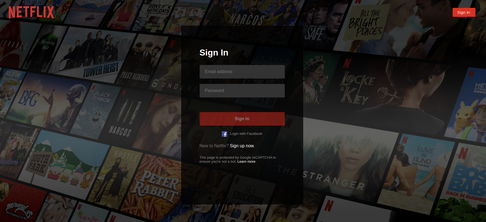
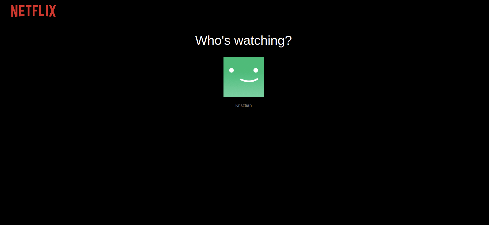

# Trailer watcher app with netflix design

This app is cloning the design of Netflix, but basically it is a trailer watcher app with not only netflix movies or serieses.   
If the user is not signed in then the landing page of Netflix is visible:

I have implemented the Sign up and sign in functionality in this page, the email subscription part is not implemented.

 
The authentication is handled by Firebase Authentication. I have implemented the Facebook login as well, but in production it is not working for some reason.
 
After login the user can select the proper registered account.

When the user selects the account, the movies will appear grouped by categories. If the API works correctly then the banner image is random, but if there are problems with it, it will be a default one.
 
 
I have used the TheMovieDB API for fetching the film or series informations, pictures.
 
 

Due to the huge amount of pictures in this page, I have implemented Lazy loading both vertical and horizontal scrolling. But it is still not perfect, the page is quiet slow.
Infinite horizontal scrolling was implemented, so if we reach the last loaded movie in a category, then the app will fetch 20 more films or serieses from that category.
 
 
In this page if the user moves the mouse on a movie, then some part of the movie description will visible on the image. If the user clicks on a movie image a Collapse info will appear with an other image from the movie poster and the full description about the movie.
 
The last element here is a Play button, which will try to find the trailer of the movie in youtube. If the algorythm find the trailer then it will be played automatically otherwise there will be an errormessage.
 
 

 
My computer was quiet overwhelmed with screen recording, that is why it was quiet slow. But the main features were visible. There is a searchfunctionality. At the moment it search for movies in the movies stored React context. The design is not updated for that functionality.
 
 
There is a language selection option with Hungarian, Germany, English language options. I haven't implemented full language support on this page. With this language selection, the movies will be fetched again with the proper language description and title. 
 
 
2 main category can be selected on this page: Series and films.

